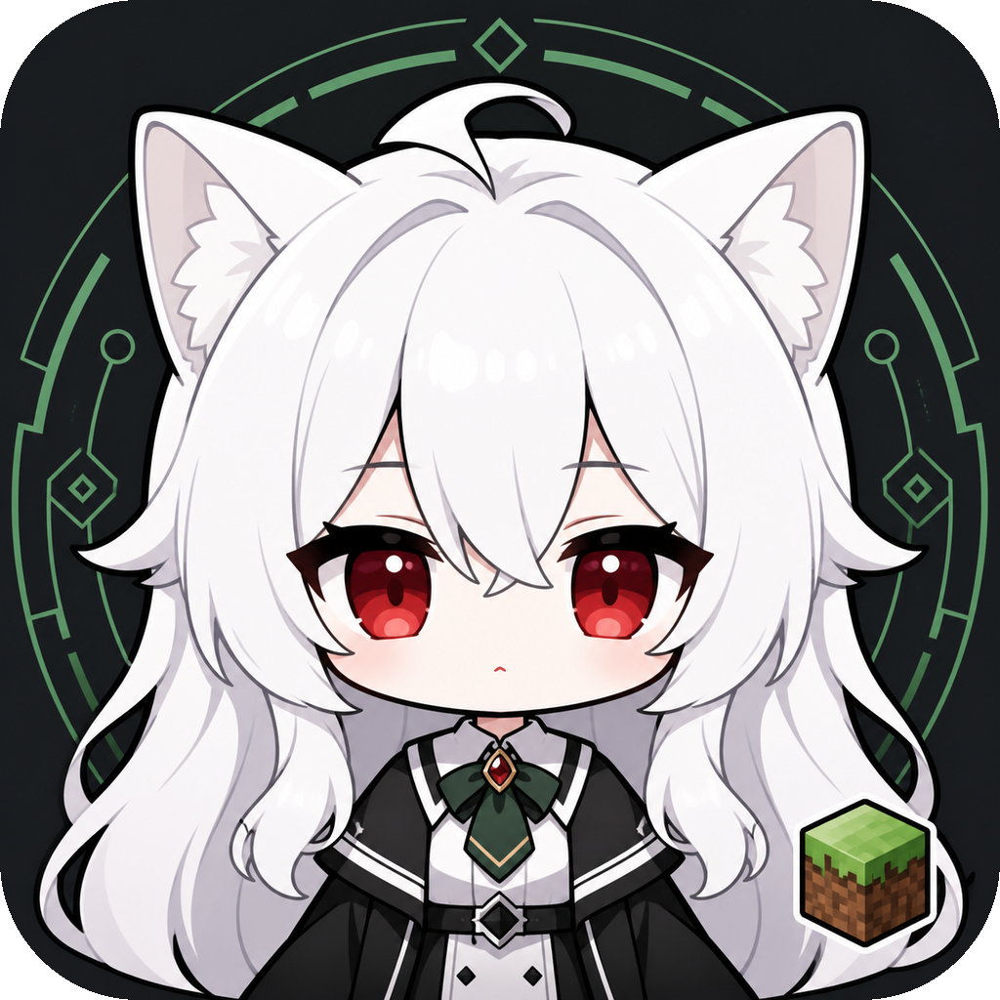

# Minecraft Codex Companion

<p align="center">
  
</p>

<p align="center">
  <strong>面向 Codex、Claude 兼容 API 与反重力 MCP 的本地优先 Minecraft Forge 1.20.1 AI NPC 陪玩系统。</strong>
</p>

<p align="center">
  <a href="https://github.com/Hakurei-git/minecraft-codex-companion/releases/latest"></a>
  <a href="https://github.com/Hakurei-git/minecraft-codex-companion/releases"></a>
  <a href="LICENSE"></a>
  
  
</p>

<p align="center">
  <a href="https://github.com/Hakurei-git/minecraft-codex-companion/releases/latest"><strong>下载</strong></a>
  · <a href="#两分钟安装流程">两分钟安装</a>
  · <a href="#能力范围">功能</a>
  · <a href="#自由聊天与人格">T 聊天</a>
  · <a href="README.md">English</a>
</p>

这是一个本地 Minecraft AI 同伴控制系统。Forge 1.20.1 模组会在你的单人世界中生成一个独立、可见的 Codex NPC；NeoForge 客户端或 1 到 3 个 Mineflayer 角色也可以连接同一控制服务。Codex、Claude 兼容 API 与反重力通过 MCP 共用这个游戏内化身，负责观察世界、聊天和执行任务。

它不是屏幕按键脚本。移动、采集、制作、烧炼、整理容器、战斗、照顾龙和建筑等动作由游戏侧执行器完成，AI 负责对话、规划、选择任务和处理失败恢复。

## 为什么使用它？

| 目标 | NPC 的实际行为 |
| --- | --- |
| 自然聊天 | 通过 Minecraft `T` 聊天回复，支持自由聊天和可配置人格 |
| 真正执行动作 | 移动、采集、制作、建造、战斗、种植、整理仓库，并把结果实体交付给玩家 |
| 完成多步骤任务 | 自动补齐工具、工作台、原料、食物、背包空间和安全返回路线 |
| 中断后继续 | 保护玩家或战斗时暂停任务，之后恢复；受支持的任务可跨重启继续 |
| 自行选择 AI 成本 | 已识别动作链可完全在本地运行；复杂自然语言可启用会额外消耗 Token 的智能 AI |
| 复用已有 AI | 通过本地 MCP 接入 Codex、Claude 兼容服务或已绑定的反重力对话 |

## 下载与兼容性

GitHub Releases 提供两种下载：

- **[Windows 安装程序 EXE](https://github.com/Hakurei-git/minecraft-codex-companion/releases/latest)**：普通用户使用的完整版本，不需要安装 Node.js 或手工构建模组。
- **[AgentKit ZIP](https://github.com/Hakurei-git/minecraft-codex-companion/releases/tag/v0.1.10)**：给支持 Skill/MCP 的 AI 客户端导入；它只包含 AI 操作说明与本机 MCP 示例，不包含游戏运行时，仍需在同一台电脑运行 EXE 安装的控制服务和 Minecraft 桥。

安装器不会内置或迁移账号、API Key、反重力会话、Minecraft 存档和本机路径。

## 两分钟安装流程

1. 从最新 Release 下载 Windows 安装程序 EXE，并核对页面公布的 SHA-256。
2. 选择自动发现的 HMCL 与 Forge 1.20.1 源实例，再设置玩家名、NPC 名字、人格和可选的 128×64 皮肤。
3. 创建隔离陪玩实例，在 HMCL 中启动这个新实例，并先进入新建的临时单人世界检查。
4. 打开本地 Dashboard，选择 Codex、Claude 兼容服务或反重力 MCP，按需开启自由聊天与智能 AI；回到游戏按 `T` 即可聊天或下达任务。

首次运行会在本机有限的用户级候选目录中自动发现：

- `Desktop`、`Downloads` 或 `OneDrive\\Desktop` 顶层的 `HMCL*.exe` / `HMCL*.jar`；
- HMCL 同目录或 `%APPDATA%` 下带 `versions` 的 `.minecraft`；
- 当前用户目录中的标准反重力 `.gemini\\antigravity\\mcp_config.json`。

找不到时仍可用“浏览”按钮手工选择。自动发现不递归扫描磁盘，不读取账号文件，也不会把发现到的路径上传或写进发布包。可通过 `MC_HMCL_PATH`、`MC_MINECRAFT_ROOT` 和 `MC_ANTIGRAVITY_CONFIG_PATH` 显式覆盖。

当前完整实机验收基于 **HMCL + Forge 1.20.1 单人世界**。HMCL 使用微软正版账号的登录流程理论上不改变实例克隆和 NPC 桥接，但尚未用正版账号完成实机验收；官方 Minecraft Launcher 的实例安装与自动启动也尚未验证，因此当前版本不把它们标记为已支持。正版用户建议先在 HMCL 中完成微软账号登录，再选择对应 Forge 1.20.1 实例。

## 已适配模组

Forge 桥为以下两个可选第三方龙模组实现了专用适配器：

| 模组 | Mod ID | Minecraft 1.20.1 实机测试版本 | 已适配能力 |
| --- | --- | --- | --- |
| Book of Dragons | `bookofdragons` | `bookofdragons-1.31-1.20.1` | 识别归属与状态、喂食、治疗、驯服、照顾龙蛋、跟随/等待、上龙/下龙、共享骑乘、飞行、降落、召回、地形脱困和协助战斗 |
| Saints Dragons | `saintsdragons` | `saintsdragons-0.8.2+forge-1.20.1-alpha` | 识别归属与状态、喂食、治疗、驯服、照顾龙蛋、跟随/等待、上龙/下龙、共享骑乘、飞行、降落、召回、地形脱困和协助战斗 |

这两个第三方模组 JAR **不会打包进** EXE 或 AgentKit。EXE 创建隔离实例时会保留所选 HMCL 源实例中已有的兼容模组。上表是已完成实机测试的目标版本；其他版本可能改变内部实体 API，目前不宣称已经验证。

## 三种 AI 入口

Dashboard 只提供三类入口：

| 入口 | 用途 | 配置方式 |
| --- | --- | --- |
| Codex | 自动回复游戏聊天并调用 Minecraft 工具 | 使用本机 Codex 登录，或添加 Codex 自定义 API |
| Claude | 自动回复游戏聊天并调用 Minecraft 工具 | 添加 Claude 兼容 API 的 Base URL、模型 ID 和 API Key |
| 反重力 | 从反重力侧通过 MCP 控制 Minecraft，并读取自由聊天收件箱 | 把 Dashboard 生成的 MCP 配置加入反重力 |

DeepSeek、Kimi 或其他第三方服务不作为独立类型。如果服务商提供 **Claude/Anthropic Messages API 兼容接口**，就在 `Claude` 中配置。当前实现会请求 `/v1/messages`，使用 `x-api-key`、`anthropic-version`、`tool_use` 和 `tool_result`；仅兼容 OpenAI Chat Completions 的地址不能直接填入这条线路。

Codex 自定义 API 必须兼容当前 Codex SDK 所需接口；它与 Claude 兼容线路是两套协议。反重力是独立的外部 MCP 控制器，不会伪装成 Claude API。自由聊天选择反重力时，控制服务会把指定玩家的消息放进 MCP 收件箱，由正在运行的反重力 Agent 读取和回复。

API Key 只保存在本机状态目录，并在 Windows 上通过当前用户的 DPAPI 加密。Dashboard 和普通 API 响应不会返回明文密钥。

## 组成

- `apps/control-plane`：本地控制服务、Dashboard 静态服务、WebSocket 桥和 MCP 服务。
- `apps/dashboard`：同伴、任务、AI 服务和建筑预览界面。
- `mods/forge-1.20.1`：Minecraft 1.20.1 Forge 47.4.21 游戏内 NPC 与客户端桥。
- `mods/neoforge-1.21.1`：Minecraft 1.21.1 NeoForge 21.1.182 客户端桥，共享任务执行器。
- `apps/mineflayer-worker`：最多 3 个独立的无界面原版协议角色。
- `.agents/skills/play-minecraft`：供 Codex 使用的 Minecraft 操作 skill。

控制服务默认只监听 `127.0.0.1:8765`。Dashboard 地址为 `http://127.0.0.1:8765`，HTTP MCP 地址为 `http://127.0.0.1:8765/mcp`，游戏桥地址为 `ws://127.0.0.1:8765/bridge`。

## 环境要求

- Node.js 24 或更高版本。
- PowerShell 5.1 或更高版本。
- Forge 1.20.1 构建使用 Java 17。
- NeoForge 1.21.1 构建使用 Java 21。
- 便携程序会自动尝试发现 HMCL、Minecraft 根目录和反重力配置；未找到或识别错误时可直接浏览选择。

## 启动控制服务

在本目录运行：

```powershell
npm install
npm run build
powershell -NoProfile -ExecutionPolicy Bypass -File .\scripts\start-companion.ps1 -SkipBuild -OpenDashboard
```

首次启动会在 `%LOCALAPPDATA%\MinecraftCodexCompanion` 创建状态文件和 256 位桥接令牌。也可以设置：

```powershell
$env:PORT = "8765"
$env:MC_COMPANION_STATE_DIR = Join-Path $env:LOCALAPPDATA "MinecraftCodexCompanion-Custom"
$env:MC_BRIDGE_TOKEN = "至少16字符的自定义令牌"
```

`MC_BRIDGE_TOKEN` 同时也必须提供给连接的模组或 Mineflayer。通常让安装器自动生成并写入两端更不容易出错。

## 配置 AI

打开 Dashboard 的 `AI 生成服务`：

1. `Codex`：直接选择内置的“跟随 Codex”，它复用当前机器的 Codex 登录和 `config.toml`。
2. `Codex` 自定义 API：新增配置，选择 Codex，填写服务名称、Base URL、模型 ID 和 API Key。
3. `Claude`：新增配置，选择 Claude，填写兼容服务的 Base URL、模型 ID 和 API Key。DeepSeek、Kimi 等网关也只放在这里，不设独立入口。
4. `反重力`：选择内置“反重力 MCP”，由便携客户端写入本机 MCP 配置，填写反重力任务列表中显示的完整会话标题，再点击“按标题绑定会话”。Minecraft 的普通聊天会固定触发这一条已绑定对话，不会按最近对话漂移，也不会为每条消息新建对话。

保存后先点“测试连接”，成功后再把 Codex 或 Claude 配置设为使用中。反重力无需在这里激活，它会从外部连接 MCP。

### 智能 AI 与本地稳定模式

`任务理解方式` 可以随时在两种模式之间切换：

- `启用智能 AI`：适合自由表达、组合目标和复杂条件。AI 只把本轮需求转换成一个结构化任务，本地驱动仍会校验 NPC、玩家、权限和参数后再提交；状态查询、召回和急停继续在本地直接执行。`单次输出预算` 可设为 128–4096 token，用于限制规划回复大小。
- `不使用智能 AI`：任务动作只走本地确定性解析器，不调用 Codex、Claude 或反重力做任务规划，也不消耗这一步的模型 token。已识别的采集、交付、制作、建造菜单、跟随、召回、停止和深挖钻石等动作链仍可执行；例如在 `T` 中发送“给我做一把钻石镐”，NPC 会自行准备梯子、火把和铁镐，向下开矿道，取得钻石后制作并交付。

任务理解方式与`自由聊天模式`是两个独立开关。不使用智能 AI 时，已识别动作仍由本地执行；普通闲聊是否调用所选 Codex、Claude 或反重力响应端，仍取决于自由聊天开关。若本地解析器不认识一条复杂动作指令，它不会假装已执行，可改用明确命令或启用智能 AI。

**Token 消耗说明：**开启智能 AI 后，复杂或本地无法识别的动作请求会额外调用一次所选模型做规划。服务商可能同时计算输入 token（玩家消息与经过最小化的世界/任务状态）和输出 token（结构化决定）。`单次输出预算`只限制请求的规划输出大小，不代表调用免费，也不一定限制服务商计算的输入 token。显式多代理模式通常还会分别调用顾问与协调器，所以消耗一般高于单代理规划。自由聊天是另一条模型调用链，只要 AI 对闲聊进行了回复也会独立消耗 token。关闭智能 AI 后，已识别的本地动作链不消耗规划模型 token，但如果自由聊天仍开启，闲聊回复依然可能消耗 token。

## 自由聊天与人格

在 Dashboard 的 `AI 生成服务` 中可以配置自由聊天：

1. 打开“自由聊天模式”。默认关闭。
2. 在“响应玩家”中填写你自己的 Minecraft 玩家名 `playerName`。只有该玩家的普通聊天会触发回复，比较时忽略首尾空格和大小写；其他玩家不会触发。
3. 选择响应端：
   - `当前 Codex / Claude`：普通聊天交给当前激活的 Codex 或 Claude 配置自动处理。
   - `Codex + Claude 协作`：Codex 规划顾问与 Claude 批评顾问并行给出只读方案，再由唯一的 Codex 协调器返回一个结构化决定；本地驱动绑定当前 NPC 和玩家后至多提交一个动作并只回复一次。两个顾问分别保留独立会话，缺少 Claude 配置或单个顾问失败时会降级继续。
   - `反重力 MCP`：普通聊天自动触发已绑定的反重力对话；无需在每条消息前写 `@`。
4. 保存设置。进入游戏后按 `T` 打开聊天框，直接发送普通消息即可，不需要写 `@codex`。

定向消息始终可用：`@Codex` 明确选择 Codex，`@Claude` 明确选择已配置的 Claude 兼容服务，`@多代理`、`@协作` 或 `@team` 显式启用 Codex + Claude 协作，`@反重力` 或 `@Antigravity` 明确送进反重力 MCP 收件箱。它们不受自由聊天开关和普通聊天响应端影响；反重力定向消息仍只接受“响应玩家”中配置的玩家名。`停`、`急停`、`stop` 等完整停止消息优先作为本地命令处理，不会送给模型解释。

协作模式的顾问与协调器都不挂载 Minecraft 或其他 MCP，也不能创建任务、移动 NPC 或发送游戏聊天。Codex 顾问进程会清空 MCP、插件、连接器、Hooks、记忆和子代理能力，使用无网络、空工作区、根目录拒读的权限配置，并只继承启动所需的最小环境；协调器输出还要经过本地 Zod 校验。只有本地驱动能绑定当前 NPC、控制权和请求玩家并至多提交一个动作，因此并行规划不会重复建造、重复采集或各回复一次。反重力无法被强制切换成这种只读顾问协议，所以继续严格绑定自己的单一会话，不加入同步协作回合。

人格设置与自由聊天设置一起保存：

- `persona.mode = "inherit"` 是默认值，沿用当前 AI 服务或 Agent 已有的人格。反重力本身已经设好人格时直接使用这一项即可，无需在 Minecraft 项目里重复配置；MCP 只增加游戏上下文和操作能力，不会清除或替换反重力的人格。
- `persona.mode = "custom"` 用于增加 Minecraft 专属人格覆盖，可填写 `displayName`、`personality`、`speakingStyle` 和 `memoryNotes`。这些内容叠加在基础人格之上，而不是清除基础人格。

便携客户端会按任务列表中的完整标题精确绑定反重力对话，并保存稳定会话 ID 后通过本机 Agent API 自动触发它；无需手工保持 `mc_list_chat_messages` 轮询，也不会因打开其他对话而改变绑定。反重力原有的人格和上下文会继续沿用。普通消息与程序重启始终复用当前会话；默认不按本地估算的轮数或字符数提前换会话，只有反重力明确报告上下文容量已满时才调用 `new-conversation` 创建一个带 `[MC-2]`、`[MC-3]` 序号的新会话并重试当前消息。高级用户可通过 `MC_ANTIGRAVITY_MAX_TURNS` 或 `MC_ANTIGRAVITY_MAX_PROMPT_CHARACTERS` 显式设置更早的本地轮换上限。所有玩家可见内容仍由 Agent 调用 `mc_chat` 发进游戏；长任务分配后 Agent 会尽快结束本轮，任务继续在游戏侧运行，控制服务会主动发送完成、失败或取消结果，从而避免反重力界面的 `Working…` 超时中断游戏动作。若会话异常假忙，可在便携客户端执行“恢复反重力会话”，也可直接在 Minecraft 的 `T` 聊天输入“恢复反重力”或“重连反重力”。上游网络或地区错误会进行 30 秒可见退避，期间每条消息都会收到状态提示；退避到期后的下一条消息会自动重新试探，不会再静默失联 10 分钟。`mc_list_chat_messages` 仅保留给手动 MCP 工作流使用。

### 记录玩家自己建造的房屋

床/复活点是稳定的“家”锚点；系统同时保存两层记忆：

- **房屋范围**：真实屋内边界，用于判断室内、保护房屋方块，以及禁止把农田/牧场误放进屋内。系统会先从床旁有屋顶的连通空间做有上限的扫描；识别失败时按你的选择回退为床中心半径 24 格的范围。
- **家园圈**：以规范化后的床脚为中心的 24 格半径，用来搜索箱子、工作台、熔炉等家园设施。农田和牧场即使位于这个圈内，也会保留各自独立的设施记录，不会被 `home` 记录吞掉。

如果房屋是你自己建的、形状不规则或自动扫描失败，可以在游戏按 `T` 直接记录，不消耗 AI Token：

1. 站在房屋一个外侧角落，输入 `记录房屋第一个角`。
2. 沿对角线走到另一个外侧角落，输入 `记录房屋第二个角`。
3. 床、屋顶或房屋结构改动后，输入 `重新识别我的房屋范围`，重新执行自动扫描。

两角会保存一个保守的矩形边界，并与当前床锚点关联，写入本机设施日志，控制服务或 Minecraft 重启后仍可复用。普通快照不会覆盖手动边界；只有床移动到旧家园圈之外，或你明确要求重新识别时才会更新。这个操作不会上传存档、API Key、反重力会话内容或其他本地文件。

### 家园环形建筑选址

自动建造使用“**完整蓝图边界**到**房屋边界**的最短水平间距”，不会拿 NPC、床或蓝图原点冒充建筑距离：

- 住宅类：距房屋 8-24 格；
- 农田、牧场、动物围栏、树场和瞭望塔等生产设施：16-40 格；
- 刷怪塔、刷石机等工业设施：40-64 格。

每个候选位置与已记录设施至少保留 12 格间距。Forge 执行器会在选址和实际施工时重复检查地形与受保护方块，只允许有上限的轻量整地；没有安全位置就保持零放置并明确失败，绝不会静默扩展到 96-160 格外。已有的远程农田和牧场不会删除，而是降级为次级据点；普通命令会在家附近新建/使用主设施，只有明确说“旧农田”“远处牧场”等才复用远程据点。玩家明确给出的坐标或已确认蓝图原点仍然优先，不会被自动环形选址改写。

## HMCL 安全克隆

不要把桥接模组直接放进正在玩的整合包实例，更不要直接在原来的重要存档中测试。安装器只创建新版本目录，不复制 `saves`、`logs` 或 `screenshots`，目标目录已存在时会直接停止。

先构建对应模组：

```powershell
npm run build:forge
# 或
npm run build:neoforge
```

Forge 1.20.1 的自动寻路使用项目内已校验的官方 Baritone API Forge `v1.10.3`，位于 `vendor\baritone`；来源与哈希记录见该目录的 `README.md`。也可以通过 `-BaritoneJar` 指定其他兼容构件。先预览克隆操作：

```powershell
$launcherPath = Read-Host "HMCL .exe or .jar path"
powershell -NoProfile -ExecutionPolicy Bypass -File .\scripts\install-hmcl-clone.ps1 `
  -SourceVersion "Your_Forge_1.20.1" `
  -TargetVersion "Your_Forge_1.20.1-Codex" `
  -OwnerName "YourMinecraftName" `
  -LauncherPath $launcherPath `
  -WhatIf
```

确认路径后去掉 `-WhatIf` 执行。脚本会复制整合包配置和模组、安装桥接模组、生成独立桥配置，并创建一个空的 `saves` 目录。完成后打开 HMCL：

```powershell
powershell -NoProfile -ExecutionPolicy Bypass -File .\scripts\open-hmcl.ps1 -LauncherPath $launcherPath
```

在 HMCL 中只启动新克隆实例，并新建空世界进行验证。Forge NPC 模式直接运行在当前单人世界；只有使用 NeoForge 远程玩家或 Mineflayer 角色时才需要独立账号和可连接的服务器。

Forge 1.20.1 的默认模式不需要第二个账号或开放局域网：进入克隆实例的世界后，模组会为当前玩家生成唯一的游戏内 NPC。NPC 是白色长发、红瞳、白色猫耳和长尾的猫娘外观，带独立生命、饥饿、装备与背包；右键打开背包，潜行右键切换跟随/等待。NPC 倒地后会保留物品并在 10 秒后恢复。

“给我一把钻石镐”会提交一条可持久化的制作任务。背包和家中箱子都没有钻石时，NPC 先准备至少 32 个梯子、32 个火把、1 把状态良好的铁镐和 1 把备用铁镐；随后优先寻找可见且可达的洞穴，没有入口时挖一格宽、两格高的安全阶梯到 Y=-58，再按 32 格长度、3 格间隔左右交替开分支。矿石只有在洞穴中裸露或被矿道挖开后才会识别，发现首块后才追踪相连矿脉；水、岩浆、沙砾、保护方块和不可破坏方块会触发改道。矿道、入口标记、火把、当前分支和最后安全站位会随 Minecraft 存档恢复，战斗插队后继续原任务。

最终反重力链路使用 `npm run smoke:live-final-diamond`。它要求自由聊天、反重力 MCP 和智能 AI 均已启用，通过 Minecraft `T` 精确发送“给我制作一把钻石镐并交给我”，并验证同一反重力会话只提交一个任务、深矿准备、Y=-58 阶梯/分支、火把、钻石、按需丢弃多组石头、制作、实体交付、开始/终态游戏回复以及可逆清理。脚本只连接 `127.0.0.1`，不会读取模型地址、Key、反重力会话正文、Minecraft 日志或截图。

构建新版 Forge JAR 后，必须先完全退出克隆游戏，再用安全升级器替换；它不会读取进程命令行，只检查窗口式 Java 客户端、操作克隆实例中的桥接 JAR，并保留世界、配置和其他模组。若自定义启动器用控制台式 `java.exe` 启动游戏，仍需自行先退出；Windows 文件锁会作为最终保护：

```powershell
powershell -NoProfile -ExecutionPolicy Bypass -File .\scripts\update-hmcl-clone.ps1 `
  -TargetVersion "Your_Forge_1.20.1-Codex"
```

Dashboard 与 MCP 都可对 NPC 执行 `summon`、`recall`、`follow`、`stay`。MCP 工具名为 `mc_control_companion`。

## 启动 1 到 3 个 Mineflayer 同伴

Mineflayer 适合原版或协议兼容服务器，需要可连接的服务器地址；单人世界必须先开放到局域网。复杂客户端模组交互应使用 Forge/NeoForge 完整客户端桥。

安装并锁定 worker 依赖：

```powershell
npm install --workspace @mc/mineflayer-worker --save-exact
```

把示例配置复制到忽略提交的运行目录，然后填写服务器、令牌和 1 到 3 个角色：

```powershell
Copy-Item .\apps\mineflayer-worker\config.example.json .\runtime\mineflayer.json
notepad .\runtime\mineflayer.json
$env:MC_BOTS_CONFIG = (Resolve-Path .\runtime\mineflayer.json)
npm run start -w @mc/mineflayer-worker
```

令牌默认位于 `%LOCALAPPDATA%\MinecraftCodexCompanion\bridge-token.txt`。`bots` 数组最多 3 项，ID 和用户名必须唯一，最多只能有一个 `chatLeader: true`。Microsoft 登录可把 `server.auth` 改为 `microsoft`；离线或局域网测试使用 `offline`。

也可以不写 JSON，直接使用环境变量：

```powershell
$env:MC_COMPANION_URL = "http://127.0.0.1:8765"
$env:MC_BRIDGE_TOKEN = (Get-Content "$env:LOCALAPPDATA\MinecraftCodexCompanion\bridge-token.txt" -Raw).Trim()
$env:MC_SERVER_HOST = "127.0.0.1"
$env:MC_SERVER_PORT = "25565"
$env:MC_SERVER_VERSION = "1.21.1"
$env:MC_BOT_AUTH = "offline"
$env:MC_BOT_NAMES = "CodexWorker1,CodexWorker2,CodexWorker3"
npm run start -w @mc/mineflayer-worker
```

## 在游戏里对话

自由聊天关闭时，可以对着连接的聊天主角色发送定向消息：

```text
@codex 跟着我，距离保持三格
@claude：帮我收集二十块圆石，然后放进附近箱子
@多代理 规划并执行一次短途食物补给
@反重力 看看这只龙的状态，缺血就治疗
```

自由聊天开启后，指定玩家按 `T` 直接说“今天先整理基地吧”之类的普通内容也能聊天或安排任务。响应端设为“当前 Codex / Claude”时会自动回复；设为“Codex + Claude 协作”时会并行规划后由 Codex 唯一执行；设为“反重力 MCP”时会自动触发已绑定的同一条反重力对话。

常用生活命令会在本地立即识别，不等待模型规划，例如：`跟着我`、`快回来`、`你在干什么`、`任务做到哪了`、`砍16个木头给我`、`把腐肉吃掉`、`吃到饱`、`把背包里的多余东西放进家里的箱子`、`从家里箱子拿16个原木`、`从家里箱子拿16个原木给我`、`去钓3次鱼`、`睡到天亮`、`把7个腐肉丢给我`、`上龙跟着我`。动作查询会直接返回当前任务、真实进度、实时动作、暂停任务及原因，不调用外部 AI。带“给我/拿来”的取物命令会在取出后继续走到玩家身边物理交付；不带交付词时物品保留在 NPC 背包。命令无需 `@`，反重力或 Codex 正忙时也能立即开始。整理时若家中容器已满，NPC 会优先使用背包里的箱子；没有箱子时会按原版消耗木板制作并安全放置工作台与箱子。放置仍经过世界保护/领地权限，绝不会覆盖已有方块。

`@Codex`、`@Claude`、`@多代理` 和 `@反重力` 始终可用于选择代理；没有点名的聊天才遵循自由聊天设置。`停`、`停止`、`急停`、`stop` 等完整消息会绕过 AI，立即取消所有任务。Dashboard 也有紧急停止按钮。

## 能力范围

- 观察位置、生命、饥饿、装备、背包、方块和附近实体。
- 聊天、跟随、守卫、移动、探索、整树/矿脉采集、制作、烧炼、耕种、钓鱼、睡觉、真实进食、物理投掷和存储。制作与烧炼会按当前世界的真实配方递归补齐工具、工作台、熔炉、燃料和允许安全采集的原始资源，例如“铁锭 → 原铁 → 石镐 → 木镐 → 原木”；农务循环会在种子耗尽时继续采集或制作种子，而不是把未完成任务误报为成功。无法安全取得时明确停止并报告，不会凭空补物品。
- 家园仓库已满时，会递归取得材料、制作并通过玩家等价的 Forge 事件真实放置工作台和箱子，再恢复同一个存储任务；不会用直接世界编辑伪造扩容成功。
- 活动任务、暂停队列和最近一次可恢复的建造失败点会写入 NPC 存档；控制服务另有不含凭据的本机任务日志。战斗插队、玩家离线、保存退出、桥接断线、整个控制服务重启、跨维度召回或 NPC 倒地后，都能重新挂接当前步骤并按优先级继续后续步骤。
- 有权限约束的战斗，以及本地反应和撤退。
- 观察、喂食、治疗、驯服、跟随、停留、骑乘、骑龙飞行/降落/召回/协战、下龙和照顾龙蛋；当前只适配整合包中的 `bookofdragons` 与 `saintsdragons`。
- 远征采集会在缺少必要矿具时先按真实配方补齐，再搜索新的资源区直到目标数量并返回交付；玩家有作弊权限时，仅在确实距离过远或寻路恢复时安全传送，未开作弊时保持加载并步行/寻路往返。
- 导入并分阶段建造 JSON、Sponge `.schem`、Litematica `.litematic` 和 PNG 像素画/参考图。
- 保存声明式生活技能，由多个受验证任务组成，不执行任意生成代码。

## 建筑导入

项目同时内置九个离线安全模板：刷石机、基础住宅、石砖小屋、农田、分类仓库、动物围栏、瞭望塔、黑暗刷怪塔和规则树场，以及装备/材料制作和两个龙模组的照料材料 Skill。游戏中按 `T` 输入“建造”会列出 1-9 菜单，随后可只回复数字或建筑名称；直接说“建造房子”“建造刷石机”仍可快捷执行。输入“帮我制作一个床”会检查背包和家中箱子，补齐木板、羊毛、剪刀及铁料，并在制作完成后回到复活点附近真实放置。黑暗刷怪塔只使用普通方块，不生成或放置刷怪笼。

住宅、农田和仓库在生存模式会先远程采集并按真实配方准备材料，创造模式直接建造；任意已确认计划在放置途中缺料时，也会在同一个可保存任务中依次查家中箱子、制作、熔炼或安全采集，补齐后返回原建筑索引。施工位被普通可破坏方块占用时，NPC 会通过 Forge 标准破坏事件挥手拆除、拾取掉落物并继续放置；领地保护仍然生效，容器、方块实体、基岩、传送门、命令/结构方块和刷怪笼不会自动拆除。建造因寻路、权限或环境失败时会保存原任务 ID、建筑原点、方块索引、失败坐标和原因；清理环境后输入“继续建造”即可从失败点恢复，不会在旁边新建一份。临时工作台和任务熔炉放在蓝图水平占地之外，任务熔炉不会占用或取走玩家已有熔炉中的物品。可通过 MCP `mc_list_skills` 与 `mc_list_build_plans` 查看来源、许可、SHA-256 与权限清单。详细安全边界见 [`docs/BUILTIN-SKILLS-AND-BUILDS.md`](docs/BUILTIN-SKILLS-AND-BUILDS.md)，公开资源取舍见 [`docs/PUBLIC-CONTENT-AUDIT.md`](docs/PUBLIC-CONTENT-AUDIT.md)。

在 Dashboard 中选择建筑文件或通过 MCP 调用 `mc_import_build`。支持：

- JSON 方块计划。
- Sponge `.schem`。
- Litematica `.litematic`。
- PNG 像素画或参考图，可选择 `xy`/`xz` 平面、尺寸、透明度阈值和颜色方块表。

导入只生成未确认预览。必须检查原点、方向、尺寸、方块数量、占用位置和材料表，再确认计划；确认本身也不会开工，最后还要把该 `planId` 作为 `build` 任务分配给同伴。

## 验证与排错

```powershell
npm test
npm run typecheck
npm run build
npm run test:installer
npm run test:updater
```

控制服务启动后可验证 MCP：

```powershell
npm run smoke:mcp
npm run smoke:capabilities
```

`smoke:capabilities` 会在当前连接的第一个同伴上依次执行全部 20 类任务；真实游戏中会产生动作和方块变化，日常使用时只在专门测试世界运行。`npm run smoke:offline` 会自动启动只监听本机的模拟器，使用临时状态目录验证 20 类任务与 MCP 工具契约，不读取真实世界、AI 密钥或反重力会话。

进入真实 Forge 测试世界后可先运行 `npm run smoke:live-preflight`。它只读验证真实 NPC 的完整状态字段、能力、家园解析和反重力单会话绑定，不发送聊天、不移动 NPC、不分配任务。动作级最终验收按 [`docs/LIVE-ACCEPTANCE.md`](docs/LIVE-ACCEPTANCE.md) 执行。

常见问题：

- Dashboard 没有同伴：确认游戏或 worker 已启动，桥地址为 `ws://127.0.0.1:8765/bridge`，两端令牌完全一致。
- 游戏聊天没有回复：自由聊天关闭时使用 `@Codex`、`@Claude`、`@多代理` 或 `@反重力`；自由聊天开启时检查 `playerName` 和响应端。Mineflayer 还需要一个 `chatLeader`。
- 多代理协作降级：确认至少 Codex 本机登录或 Codex 自定义配置可用；Claude 未配置时仍会由 Codex 顾问和协调器继续，但不会伪造 Claude 方案。协作模式只产生一条最终游戏回复。
- 游戏里看不到 NPC：确认克隆实例已升级到 Forge 模组 `0.2.0`，再使用 Dashboard 的“召回”或 MCP `mc_control_companion` 的 `recall`；旧 `0.1.0` 只会控制玩家自身。
- 反重力自由聊天没有回复：确认响应端是“反重力 MCP”、反重力程序正在运行，并在便携客户端查看“自动触发已就绪”；核对会话标题后点“按标题绑定会话”。网络刚恢复或会话假忙时，可直接在 Minecraft 的 `T` 聊天输入“恢复反重力”，也可点“恢复反重力会话”。普通聊天不需要 `@`，手动 MCP 模式才需要轮询 `mc_list_chat_messages`。
- Claude 测试失败：确认地址支持 Anthropic Messages API 和工具调用，而不是只支持 OpenAI Chat Completions。
- 移动/采集失败：Forge NPC 不依赖 Baritone；检查目标是否受领地保护、路径是否完全封闭、背包是否已满，以及未开作弊时是否仍在远程步行。NeoForge 或 Mineflayer 再检查各自的导航能力和服务器兼容性。
- 建筑无法开始：导入后必须先确认计划，再分配 `build` 任务；生存模式会先查家中仓库，再按真实配方制作/熔炼或采集安全原料。液体桶、危险/不可再生方块及没有安全上游的模组材料仍需玩家提前放入背包或家中箱子；同时检查权限、背包空间和目标区域是否被占用。
- 连接后立刻掉线：检查游戏版本、服务器认证方式、角色账号是否重复，以及模组整合包是否要求客户端专用握手。

本机持久状态默认在 `%LOCALAPPDATA%\MinecraftCodexCompanion`。其中包含桥令牌、加密 AI 配置、自由聊天与人格设置、Codex 对话线程引用、技能、建筑计划，以及不含 API Key 的 `task-journal.json`。回复中的替换字符或高度可疑的全问号内容会在进入游戏前被拦截为明确的编码错误。排错时不要把整个状态目录连同密钥直接上传。

## 社区与参与贡献

- 安装和使用问题请优先前往 [GitHub Discussions](https://github.com/Hakurei-git/minecraft-codex-companion/discussions)。
- 可复现 Bug 请使用结构化的 [Issue 表单](https://github.com/Hakurei-git/minecraft-codex-companion/issues/new/choose)。
- 提交代码、文档、翻译、建筑蓝图或模组兼容修复前，请阅读 [CONTRIBUTING.zh-CN.md](CONTRIBUTING.zh-CN.md)。
- 安全漏洞请按 [SECURITY.md](SECURITY.md) 私下报告，不要创建公开 Issue。
